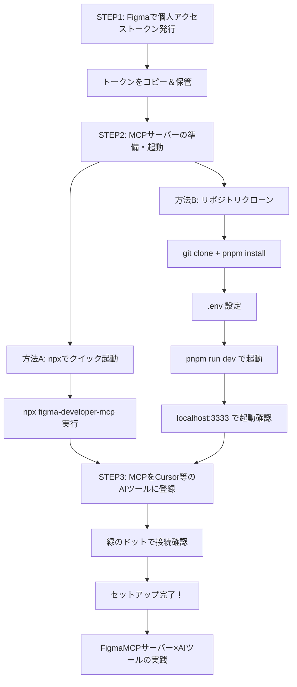

# はじめに

Figma の MCP サーバーを活用して「デザインからコーディングの効率化！」を試している方が多く見られたので、私も試してみようと思いチャレンジしました。
しかし環境の準備に躓くポイントがいくつかあったので、今後同じような方が居た際に先立つよう備忘録として残します。

# Figma MCP の導入方法

導入にあたり大変参考になった記事は以下の 2 つです。

https://qiita.com/syukan3/items/497a8a1aa93b4e2bafe8
https://zenn.dev/takna/articles/mcp-server-tutorial-06-figma

## 試したこと

以下の方法 AB どちらも試してみたところ、どちらでも躓いています。
後述の躓きポイントには方法 AB どちらで詰まったのかも記載します。どちらかの方法で詰まったかに応じて参考にしてください。



# 躓きポイントと対応した方法

## 👷 figma-developer-mcp のバージョンに問題があった

:::message
結論：安定版バージョンを指定
:::

こちらの問題は、方法 AB どちらでも起こります。

まず方法 A の「npx でクイック起動」を試そうとして、以下を実行しました。

```
npx figma-developer-mcp --figma-api-key=YOUR_TOKEN
```

すると、ERR_MODULE_NOT_FOUND で chunk-IPLSVZQQ.js が見つからない…というエラーメッセージが返ってきました。
この時 latest は 0.2.2 だったのですが、展開サイズ 46 kB・ファイル数 11 と極端に少なく何か欠落していたようです。

そこで 1 つ前の v 0.2.1 に固定して実行したところ、正常に起動することが確認できました。

```
npx -y figma-developer-mcp@0.2.1 --figma-api-key=YOUR_TOKEN
```

また、Cursor 側で FigmaMCP サーバーを設定する際も、以下のように安定版で固定されるようにしています。

```
  "mcpServers": {
    "figma-developer-mcp-test": {
      "command": "npx",
      "args": ["-y", "figma-developer-mcp@0.2.1", "--stdio"],
      "env": {
        "FIGMA_API_KEY": "YOUR_TOKEN"
      }
    }
  }
```

## 🗄️ Figma のファイルが読み取れない

:::message
結論：Figma ファイルを/design/ではなく、/file/という形式にする
:::

こちらの問題は、Cursor 上で FigmaMCP と接続中に起こりました。

Cursor で Figma の MCP サーバー使用できるようになったため、早速 Figma ファイルを指定してコーディングをしてもらおうと思ったところ、Agent から以下のような文言が返ってきました…

_Agent への指示_

Agent からの返答 ↓

```

Figma ファイルへのアクセス権限が不足しているため、データの取得に失敗しました（403 Forbidden）。
【対応案】
Figma ファイルが「Anyone with the link（リンクを知っている全員）」に閲覧権限があるかご確認ください。
もしくは、必要な画像やデザイン情報をエクスポートしていただくか、ファイルの共有設定を変更してください。
ご対応後、再度ご指示いただければ、HTML/CSS 実装を進めます。

```

アクセス権限は「アクセス可能なユーザー：ユーザー全員」「権限：読み取り」にしていたため、閲覧権限には問題がないはずです。Figma ファイル側で「組織外のユーザーを含む全員がこのファイルにアクセスできるようになります。」という記載も確認しています。
そこで Agent と何往復かやり取りをしたところ、2024 年に Figma の URL 形式が変わっていたことが分かりました。

https://www.figma.com/developers/embed#embed-kit-2
デザインファイルが以下のルールに変更になっており、FigmaMCP サーバーでは、/file/でないと読み取れませんでした。

- 旧：figma.com/file/{file_key}/{file_name}
- 新：figma.com/design/{file_key}/{file_name}

そのため、共有リンク発行後に/design/部分を/file/にすることでデータにアクセス可能になりました。

こちらは今後改善される可能性があると思います。

## 🔍️ Figma のデータが読み取れない

:::message
結論：Figma の API の権限を見直す
:::

Figma のファイルは読み取れたものの、デザインデータの取得時にエラーになりました。
成功した場合は以下の画像のように、Called MCP tool の後に緑のチェックが入ります。


エラーは Figma の API 接続用に個人アクセストークンを発行した際の権限設定不足が原因でした。
FigmaAPI の個人アクセストークンは、ダッシュボード左上の個人アイコンをクリックし、設定 > セキュリティから作成できます。発行の際に、スコープを設定可能です。


このスコープを「ファイルのコンテンツ」のみを読み取りにしていたことが原因でした。
以下をスコープに設定したトークンを MCP サーバーに設定し直すことで、無事にデザインデータが読み取れるようになりました。

- ✅ ファイルのコンテンツ
- ✅ 開発リソース
- ✅ ライブラリアセット
- ✅ ライブラリのコンテンツ

ここは必要に応じてスコープを設定してください。

# 終わりに

設定は無事に完了したので、次は実際に FigmaMCP サーバーを使ってみて良かった点やポイントを紹介します。
